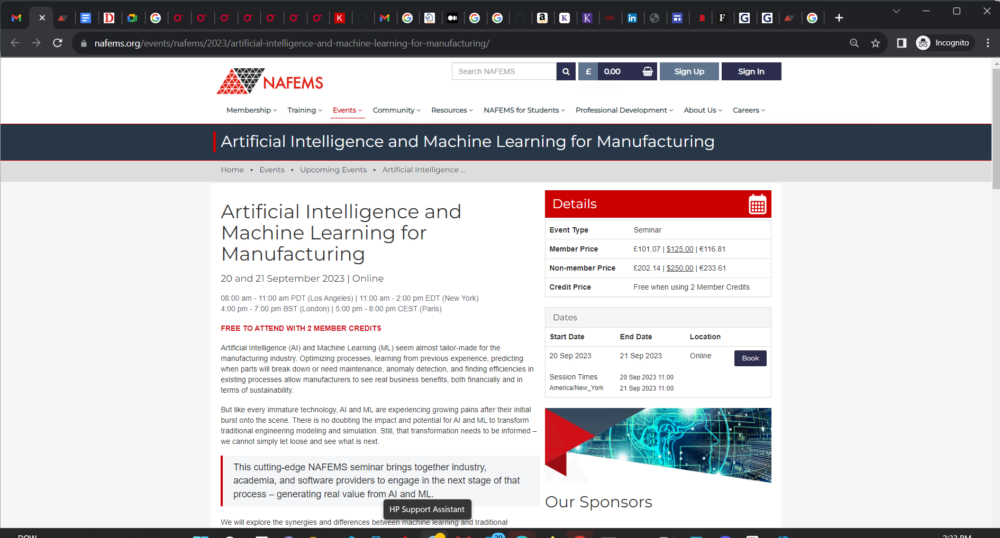
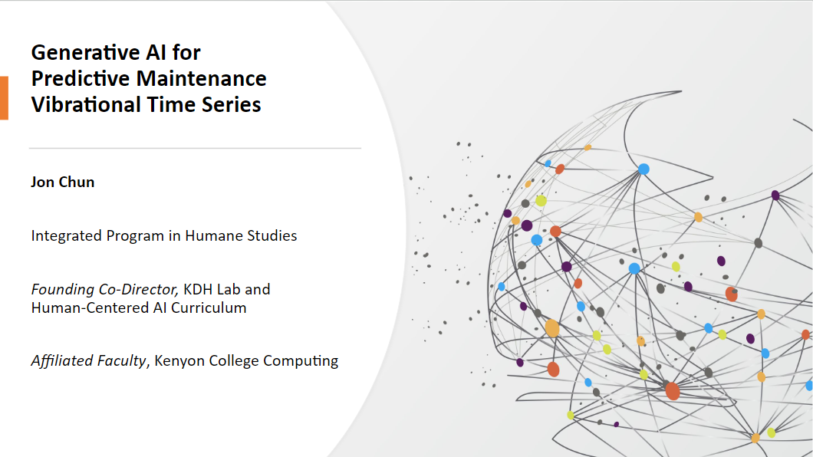

# NAFEMS Conference

## Artificial Intelligence and Machine Learning for Manufacturing
* https://www.nafems.org/events/nafems/2023/artificial-intelligence-and-machine-learning-for-manufacturing/
* 20-21 September 2023

  
### Multilayered Large Language Models Strategies for Generating Time Series Simulation Data
* https://www.nafems.org/events/nafems/2023/artificial-intelligence-and-machine-learning-for-manufacturing/kenyon-abstract/
* Jon Chun
* Notes and references for NAFEMS talk on augmenting anomalous time series datasets

# NAFEMS Conference

## Artificial Intelligence and Machine Learning for Manufacturing
- 20-21 September 2023

### Multilayered Large Language Models Strategies for Generating Time Series Simulation Data
- https://www.nafems.org/events/nafems/2023/artificial-intelligence-and-machine-learning-for-manufacturing/kenyon-abstract/
- Jon Chun  
-  for NAFEMS talk on augmenting anomalous time series datasets

## NAFEMS Anomalous Time Series Augmentation
- 20 Sep 2023
- Jon Chun

# NAFEMS Conference

## Artificial Intelligence and Machine Learning for Manufacturing
- [Event link](https://www.nafems.org/events/nafems/2023/artificial-intelligence-and-machine-learning-for-manufacturing/)
- 20-21 September 2023  

### Multilayered Large Language Models Strategies for Generating Time Series Simulation Data
- [Abstract link](https://www.nafems.org/events/nafems/2023/artificial-intelligence-and-machine-learning-for-manufacturing/kenyon-abstract/)
- Jon Chun
- Notes and references for NAFEMS talk on augmenting anomalous time series datasets

## NAFEMS Anomalous Time Series Augmentation  
- 20 Sep 2023
- Jon Chun

## I. Abstract

Explore generative deep learning approaches to augment anomalous time series datasets like the Case Western Bearing Dataset in preparation to fine-tune LLM (foundational models) for anomaly detection.

## II. Introduction and Motivation

### A. Problem Statement

### B. Investment and Market Growth: Growth of Synthetic Data

- (15 Mar 2023) [How synthetic data is boosting AI at scale](https://venturebeat.com/ai/synthetic-data-to-boost-ai-at-scale/) 
- (12 Jun 2022) [Synthetic Data Is About To Transform Artificial Intelligence](https://www.forbes.com/sites/robtoews/2022/06/12/synthetic-data-is-about-to-transform-artificial-intelligence/?sh=19c13de37523)
- Gartner Generative AI: [Gartner Link](https://www.gartner.com/en/insights)

## III. Bearing Fault Detection 

### 1. Bearing Vibration Analysis

- Predictive Maintenance and Vibration Resources: [Github Link](https://github.com/Charlie5DH/PredictiveMaintenance-and-Vibration-Resources)
- Vibrational-Analysis [Github Topic](https://github.com/topics/vibrational-analysis)
- Bearing Fault Detection Vibration Analysis: [Blog Link](https://ncd.io/blog/bearing-fault-detection-vibration-analysis/#:~:text=Vibration%20analysis%20is%20a%20widely,issues%2C%20such%20as%20bearing%20faults)
- Animated Introduction to Vibration Analysis: [YouTube Link](https://www.youtube.com/watch?v=Vj1xmze3GlE)
- Envelope Analysis: [Sensemore Link](https://sensemore.io/envelope-analysis/#:~:text=Envelope%20analysis%2C%20sometimes%20referred%20to,frictional%20forces%20produced%20by%20bearings) 
- (June 2009) Impact of geometrical defects on bearing assemblies with integrated raceways in aeronautical gearboxes - [ScienceDirect Link](https://www.sciencedirect.com/science/article/pii/S0022460X09000978)
- Phased Array Ultrasonic Testing: [YouTube Link](https://www.youtube.com/watch?v=g4C-zh51FM0)
- Applied Vibrational Analysis, Analyzing Bearing Vibrations: [YouTube Link](https://www.youtube.com/watch?v=53tRsvGmhTY)  
- PeakVue Vibration Analysis, Outer Race Defect: [YouTube Link](https://www.youtube.com/watch?v=9QtJbQ61Hsw)

### 2. Frequency Transforms

- A Survey on Deep Learning based Time Series Analysis with Frequency Transformation (15 Sep 2023) [Arxiv Link](https://arxiv.org/abs/2309.07711)

## IV. Time Series Topics

### A. Time Series and Signal Processing

- (3 Feb 2023) [Github Link](https://github.com/cure-lab/Awesome-time-series) A comprehensive survey on the time series papers from 2018-2022 (we will update it in time ASAP!) on the top conferences (NeurIPS, ICML, ICLR, SIGKDD, SIGIR, AAAI, IJCAI, WWW, CIKM, ICDM, WSDM, etc.)
- Research Paper (14 Sep 2023) [Github Link](https://github.com/qingsongedu/awesome-AI-for-time-series-papers) A professional list of Papers, Tutorials, and Surveys on AI for Time Series in top AI conferences and journals. 
- Papers, Libraries, Benchmarks (Feb 2023) [Github Link](https://github.com/cure-lab/Awesome-time-series) A comprehensive survey on the time series domains
- [time-series-analysis · GitHub Topics](https://github.com/topics/time-series-analysis)
- [time-series · GitHub Topics](https://github.com/topics/time-series)
- TS AI papers, tutorials and surveys (14 Sep 2023) [Github Link](https://github.com/qingsongedu/awesome-AI-for-time-series-papers) A professionally curated list of papers (with available code), tutorials, and surveys on recent AI for Time Series Analysis (AI4TS), including Time Series, Spatio-Temporal Data, Event Data, Sequence Data, Temporal Point Processes, etc., at the Top AI Conferences and Journals, which is updated ASAP (the earliest time) once the accepted papers are announced in the corresponding top AI conferences/journals. Hope this list would be helpful for researchers and engineers who are interested in AI for Time Series Analysis.

### B. Deep Learning Time Series Forecasting

- TS Forecasting and DL (12 Sep 2023) [Github Link](https://github.com/DaoSword/Time-Series-Forecasting-and-Deep-Learning) Resources about time series forecasting and deep learning, as well as other resources like competitions, datasets, courses, blogs, code, etc.
- (Aug 2023) [Github Link](https://github.com/salesforce/OmniXAI) OmniXAI: A Library for eXplainable AI 
- (24 Mar 2023) [Towards Data Science Link](https://towardsdatascience.com/xai-for-forecasting-basis-expansion-c6e14186d4ff) XAI for Forecasting: Basis Expansion 

### C. Time Series Anomaly Detection

- TS Anomaly Detection Resources: (6 Jun 2023) [Github Link](https://github.com/yzhao062/anomaly-detection-resources) Anomaly detection related books, papers, videos, and toolboxes
- (21 Sep 2022) [Github Link](https://github.com/rob-med/awesome-TS-anomaly-detection) List of tools & datasets for anomaly detection on time-series data.
- (3 Jul 2023) [Github Link](https://github.com/zamanzadeh/ts-anomaly-benchmark) Time-Series Anomaly Detection Comprehensive Benchmark This repository updates the comprehensive list of classic and state-of-the-art methods and datasets for Anomaly Decetion in Time-Series. This is part of an onging research at Time Series Analytics Lab, Monash University.
- [Time Series Anomaly Detection · GitHub Topics](https://github.com/topics/time-series-anomaly-detection) 
- (26 Dec 2021) [Github Link](https://github.com/tvhahn/Manufacturing-Data-Science-with-Python) with Colabs
- Papers:
  - (4 Sep 2023) [Github Link](https://github.com/ChunjingXiao/DiffAD) DiffAD Imputation-based Time-Series Anomaly Detection with Conditional Weight-Incremental Diffusion Models
  - (4 Sep 2023) [Github Link](https://github.com/microsoft/msticpy) MSTICPY MS Threat Intelligence Python Tools
  - (8 May 2023) [Github Link](https://github.com/linkedin/luminol) luminol: Anomaly Detection and Correlation library
  - (9 May 2022) [Github Link](https://github.com/astha-chem/mvts-ano-eval) MTS Deep Learning Anomaly Detection A repository for code accompanying the manuscript 'An Evaluation of Anomaly Detection and Diagnosis in Multivariate Time Series' (published at TNNLS)
  - (31 May 2020) [Github Link](https://github.com/DawidSitnik/Anomaly-Detection-in-Time-Series-Datasets) ML and LSTM Outlier Detection This is project made for one of the subjects at Warsaw University of Technology. Its aim is to detect anomaly in time series data.

### D. Time Series Synthesis

#### 1. Statistical ML

- GRATIS.R [Youtube Link](https://www.youtube.com/watch?v=F3lWECtFa44)
- ADSN Conf Syn Data: [Youtube Link](https://www.youtube.com/watch?v=F3lWECtFa44)
- Tabular/Statistical: [Github Link](https://github.com/sdv-dev/SDV) Synthetic data generation for tabular data
- CTGAN: [Github Link](https://github.com/ydataai/ydata-synthetic) Synthetic data generators for tabular and time-series data  
- [Github Link](https://github.com/uchidalab/time_series_augmentation) An example of time series augmentation methods with Keras

#### 2. Deep Learning

- Kera Tutorials: [Keras Link](https://keras.io/examples/generative/)
- Data Augmentation techniques in time series domain: a survey and taxonomy (24 Mar 2023) [Springer Link](https://link.springer.com/article/10.1007/s00521-023-08459-3)
- TTransFusion: Generating Long, High Fidelity Time Series using Diffusion Models with Transformers (24 Jul 2023) [Arxiv Link](https://arxiv.org/pdf/2307.12667.pdf)

## V. Vibrational Datasets and Code

### A. Public Data

#### 1. Case Western Bearing Data

- Case Western Bearing (5 Dec 2021): [Github Link](https://github.com/Jpickard1/BallBearings) This repository contains data and code to recreate classification results for fault detection in ball bearings. The data comes from the Case Western Reserve Bearing Data Center
- Github (17 Feb 2021): [Github Link](https://github.com/s-whynot/CWRU-dataset) Case Western Reserve University Bearing Fault Dataset
- Github Metadata for Python (14 Apr 2020): [Github Link](https://github.com/ryanjung94/cwru_py3) Collect Case Western Reserve University Bearing Data in python 3
- Github (14 May 2022): [Github Link](https://github.com/yzbbj/Data-of-Case-Western-Reserve-University/tree/main/Normal%20Baseline%20Data) Data-of-Case-Western-Reserve-University/Normal Baseline Data 

#### 2. Multivariate Time Series

- M4 Dataset and Competition: [Github Link](https://github.com/Mcompetitions/M4-methods)
- MTS [Github Link](https://github.com/laiguokun/multivariate-time-series-data) 
- Anomaly Datasets (10 Sep 2023) [Github Link](https://github.com/GuansongPang/ADRepository-Anomaly-detection-datasets) ADRepository: Real-world anomaly detection datasets, including tabular data (categorical and numerical data), time series data, graph data, image data, and video data.
- AI4I 2020 UCI PdM [Dataset Link](https://archive.ics.uci.edu/ml/datasets/AI4I+2020+Predictive+Maintenance+Dataset) AI4I 2020 Predictive Maintenance Dataset - UCI Machine Learning Repository

Here is the continued outline with GitHub markdown preserving the URLs:

### 3. Bearing Vibrational Code

- Rolling element bearing fault diagnosis using convolutional neural network and vibration image (sciencedirectassets.com) (2019) Hoang & Kang
- [PDF] Fault Detection in Ball Bearings | Semantic Scholar (19 Sep 2022) Pickard & Moll
- Case Western Bearing Colab EDA (5 Dec 2021): [Github Link](https://github.com/Jpickard1/BallBearings) This repository contains data and code to recreate classification results for fault detection in ball bearings. The data comes from the Case Western Reserve Bearing Data Center  
- (27 Nov 2019) [Github Link](https://github.com/raady07/CNN-for-bearing-fault-diagnosis) CNN applied to bearing signals for analysis
- SB-PdM: a tool for predictive maintenance of rolling bearings based on limited labeled data (Feb 2023) [Github Link](https://github.com/Western-OC2-Lab/SB-PdM-a-tool-for-predictive-maintenance-of-rolling-bearings-based-on-limited-labeled-data/blob/main/SB_PdM_Tool.ipynb)
- Vibration-Based Fault Diagnosis with Low Delay (26 Jan 2023) [Github Link](https://github.com/Western-OC2-Lab/Vibration-Based-Fault-Diagnosis-with-Low-Delay)
- Rolling element bearing fault diagnosis using convolutional neural network and vibration image (11 Jul 2021) [Github Link](https://github.com/lestercardoz11/fault-detection-for-predictive-maintenance-in-industry-4.0) Nine colab notebooks for machine learning and deep learning for predictive analysis in industry 4.0.
- Github (29 Sep 2022) [Github Link](https://github.com/Yi-Chen-Lin2019/Predictive-maintenance-with-machine-learning) This project is about predictive maintenance with machine learning. It's a final project of my Computer Science AP degree. Supervised and unsupervised models for 3 tasks, 1. Anomaly detection, 2. Remaining useful life and 3. Failure prediction on 2 datasets a. CW Bearing and b. NASA Battery
- Github *.R (3 Jan 2023) [Github Link](https://github.com/Miltos-90/Failure_Classification_of_Bearings) Failure Mode Classification from the NASA/IMS Bearing Dataset
- Github (9 Feb 2022) [Github Link](https://github.com/devamsheth21/Bearing-Fault-Detection-using-Deep-Learning-approach) Detection and multi-class classification of Bearing faults using Image classification from Case Western Reserve University data of bearing vibrations recorded at different frequencies. Developed an algorithm to convert vibrational data into Symmetrized Dot Pattern images based on a Research paper. Created an Image dataset of 50 different parameters and 4 different fault classes, to select optimum parameters for efficient classification. Trained and tested 50 different datasets on different Image-net models to obtain maximum accuracy. Obtained an accuracy of 98% for Binary classification of Inner and Outer race faults on Efficient Net B7 model on just 5 epochs.
- Github (15 Dec 2022) [Github Link](https://github.com/MideTechnology/endaq-python) A comprehensive, user-centric Python API for working with enDAQ data and devices Manual: [Docs Link](https://docs.endaq.com/en/latest/api_ref.html) Video: [endaq Link](https://endaq.com/pages/endaq-open-source-python-library-for-shock-vibration-analysis) 
- Github (15 Nov 2020) [Github Link](https://github.com/Vibration-Testing/vibrationtesting) Manual: [Installation Link](http://vibration-testing.github.io/vibrationtesting/installation.html)
- Github (30 Sep 2021) TadGAN (w/LSTM) [Github Link](https://github.com/arunppsg/TadGAN) Code for the paper "TadGAN: Time Series Anomaly Detection Using Generative Adversarial Networks" Paper [Arxiv Link](https://arxiv.org/abs/2009.07769)
- (25 Jan 2023) Survey of Methods [Github Link](https://github.com/Dhueper/TimeSeries-AnomalyDetection) Anomaly detection in time series for space applications
- (25 Jan 2022) [Github Link](https://github.com/PimW/Time-Series-Anomaly-Detection) Time series analysis using a grammar based compression algorithm. Uses the discretization used for time series in PySAX and the grammar based compression of Sequitur as basis for the compression of the time series. The algorithm then uses the compression to calculate a score of the compressibility of each point in the time-series. If the compressibility of a sequence of points is low for a certain sequence then an anomaly is detected.

## VI. Model Architecture Types (some mixed)

### A. RNN: LSTM/GRU

- Visualization: LSTMViz (19 Nov 2021) [Github Link](https://github.com/HendrikStrobelt/lstmvis)
- Paper: LSTM and GRU Neural Networks as Models of Dynamical Processes Used in Predictive Control: A Comparison of Models Developed for Two Chemical Reactors (17 Aug 2021) [MDPI Link](https://www.mdpi.com/1424-8220/21/16/5625)
- Model: AE-RNN [Github Link](https://github.com/RobRomijnders/AE_ts)

### B. VAE

- Overview: [Blog Link](https://riccardo-cantini.netlify.app/post/cnn_vae_mnist/)
- VAE Keras Tutorial: [Keras Link](https://keras.io/examples/generative/vae/)
- VAE Time Series Anomaly Detection UC Berkeley Milling Dataset:
  - Tutorial: [Blog Link](https://www.tvhahn.com/posts/building-vae/)
  - Colab: [Github Link](https://github.com/tvhahn/Manufacturing-Data-Science-with-Python/tree/master/Metal%20Machining)

### C. GAN 

#### 1. Open Source: DoppleGANger

- Paper (17 Jan 2021) [Arxiv Link](https://arxiv.org/abs/2001.08106) Using GANs for Sharing Networked Time Series Data: Challenges, Initial Promise, and Open Questions
- Repo (12 Aug 2023) [Github Link](https://github.com/fjxmlzn/DoppelGANger) [IMC 2020 (Best Paper Finalist)] Using GANs for Sharing Networked Time Series Data: Challenges, Initial Promise, and Open Questions

#### 2. Commercial: Gretel.ai DGAN

- Overview: [YouTube Link](https://www.youtube.com/watch?v=XVPFR-P6vlg&t=279s)
- DGAN Doc: [Docs Link](https://docs.gretel.ai/reference/synthetics/models/gretel-dgan)
- DGAN Workshop (5 Oct 2022): [YouTube Link](https://www.youtube.com/watch?v=YF3ivHw9KmA)  
- DGAN Blog (15 Sep 2022): [Blog Link](https://gretel.ai/blog/generate-time-series-data-with-gretels-new-dgan-model)   
- Colab (May 2023) [Github Link](https://github.com/gretelai/gretel-blueprints/blob/main/docs/notebooks/create_synthetic_data_from_dgan_api.ipynb)
- DoppleGANger Pytorch (21 Jun 2022): [Blog Link](https://gretel.ai/blog/create-synthetic-time-series-with-doppelganger-and-pytorch)

#### 3. Commercial: yData

- Why synthetic data [ydata.ai Link](https://ydata.ai)   

#### 4. WGAN Tutorial:

- [Medium Link](https://jonathan-hui.medium.com/gan-wasserstein-gan-wgan-gp-6a1a2aa1b490)
- WGAN/1-Lipschitz constraint: [Medium Link](https://jonathan-hui.medium.com/gan-wasserstein-gan-wgan-gp-6a1a2aa1b490)

#### 5. CGAN

- Keras Code: Conditional GAN (CGAN): [Keras Link](https://keras.io/examples/generative/conditional_gan/)

#### 6. Newer GAN Models

- TimeGAN
  - (14 Oct 2022) [Github Link](https://github.com/jsyoon0823/TimeGAN) Codebase for Time-series Generative Adversarial Networks (TimeGAN) - NeurIPS 2019
- TimeSynth
  - (20201130) [Github Link](https://github.com/TimeSynth/TimeSynth) TimeSynth: A Multipurpose Library for Synthetic Time Series Generation in Python TimeSynth is an open source library for generating synthetic time series for model testing. The library can generate regular and irregular time series. The architecture allows the user to match different signals with different architectures allowing a vast array of signals to be generated.
- LTSNet
  - (27 Apr 2022) [Github Link](https://github.com/fbadine/LSTNet) A Tensorflow / Keras implementation of "Modeling Long- and Short-Term Temporal Patterns with Deep Neural Networks" paper
  - (21 Dec 2019) [Github Link](https://github.com/laiguokun/LSTNet)
- RTSGAN
  - [Github Link](https://github.com/acphile/RTSGAN) 
- TSGAN for Cloud Workload
  - (16 Dec 2022) [Github Link](https://github.com/soraminnnn/TsGAN) PyTorch implementation of A GAN-based method for time-dependent cloud workload generation.
- TSGAN for Biology   
  - (13 Dec 2019) [Github Link](https://github.com/numancelik34/TimeSeries-GAN) Generation of Time Series data using generatuve adversarial networks (GANs) for biological purposes.

### D. Transformers/Attention Heads

- Paper: Transformers in Time Series: A Survey (11 May 2023) [Arxiv Link](https://arxiv.org/abs/2202.07125)

### E. Energy

### F. Diffusion

- Huggingface Diffusers: [Huggingface Link](https://huggingface.co/docs/diffusers/index)
- Video: [YouTube Link](https://www.youtube.com/watch?v=fbLgFrlTnGU)

## V. Multi-Model Frameworks / Benchmarks

- Synthcity
  - Github (20230912 208 stars) [Github Link](https://github.com/vanderschaarlab/synthcity) A library for generating and evaluating synthetic tabular data for privacy, fairness and data augmentation.
- TSGM (VAEs, GANS, Metrics)
  - Github (20230918 31 stars) [Github Link](https://github.com/AlexanderNikitin/tsgm) Generative modeling of synthetic time series data and time series augmentations
  - Documentation (pypi) [TSGM Docs](https://tsgm.readthedocs.io/en/latest/) Time Series Simulator (TSGM) Official Documentation
  - Colab: [Colab Link](https://colab.research.google.com/github/AlexanderNikitin/tsgm/blob/master/notebooks/Getting%20started%20with%20TSGM.ipynb) Getting started with TSGM.ipynb  
- SB-PdM (Similarity-Based Predictive Maintenance) Feat Ext/Sim Metrics
  - Repo: [Github Link](https://github.com/Western-OC2-Lab/SB-PdM-a-tool-for-predictive-maintenance-of-rolling-bearings-based-on-limited-labeled-data/blob/main/SB_PdM_Tool.ipynb) SB-PdM-a-tool-for-predictive-maintenance-of-rolling-bearings-based-on-limited-labeled-data/SB_PdM_Tool.ipynb 
  - Colab: [Github Link](https://github.com/Western-OC2-Lab/SB-PdM-a-tool-for-predictive-maintenance-of-rolling-bearings-based-on-limited-labeled-data/blob/main/SB_PdM_Tool.ipynb) SB-PdM-a-tool-for-predictive-maintenance-of-rolling-bearings-based-on-limited-labeled-data/SB_PdM_Tool.ipynb
- Flow-Forecast
  - (12 Sep 2023) [Github Link](https://github.com/AIStream-Peelout/flow-forecast) Flow Forecast (FF) is an open-source deep learning for time series forecasting framework. It provides all the latest state of the art models (transformers, attention models, GRUs, ODEs) and cutting edge concepts with easy to understand interpretability metrics, cloud provider integration, and model serving capabilities. Flow Forecast was the first time series framework to feature support for transformer based models and remains the only true end-to-end deep learning for time series framework.
  - Manual: [Wiki Link](https://flow-forecast.atlassian.net/wiki/spaces/FF/pages/92864513/Getting+Started)
  - Tutorials: [Github Link](https://github.com/AIStream-Peelout/flow_tutorials)

## VI. SOTA Research

- C-GATS
  - Paper: [Amazon Link](https://assets.amazon.science/4c/76/584054b94a4baaafd14ec3ed43af/c-gats-conditional-generation-of-anomalous-time-series.pdf) c-gats-conditional-generation-of-anomalous-time-series.pdf
  - OpenReview.org (5 May 2023) [OpenReview Link](https://openreview.net/forum?id=YCIP4bJRewR) C-GATS: Conditional Generation of Anomalous Time Series 
- IH-TCGAN (1 May 2023)
  - Paper: [MDPI Link](https://www.mdpi.com/1099-4300/25/5/781) Entropy | Free Full-Text | IH-TCGAN: Time-Series Conditional Generative Adversarial Network with Improved Hausdorff Distance for Synthesizing Intention Recognition Data
- ImDiffusion
  - [Github Link](https://github.com/17000cyh/IMDiffusion) 17000cyh/IMDiffusion
- TransFusion 
  - [Arxiv Link](https://arxiv.org/pdf/2307.12667.pdf)
  
## VII. Evaluation Metrics

### 1. Leaderboards

- M4: [PapersWithCode Link](https://paperswithcode.com/dataset/m4)
- MVTec AD: [PapersWithCode Link](https://paperswithcode.com/dataset/mvtec-ad) MVTec AD Benchmark (Anomaly Detection) 

### 2. Testing Frameworks and Benchmarks

- (24 Feb 2022) [Github Link](https://github.com/numenta/NAB) numenta/NAB: The Numenta Anomaly Benchmark Numenta Anomaly Benchmark (NAB) v1.1 is a novel benchmark for evaluating algorithms for anomaly detection in streaming, real-time applications. It is composed of over 50 labeled real-world and artificial timeseries data files plus a novel scoring mechanism designed for real-time applications.
- (6 Aug 2023) [Github Link](https://github.com/DeepIntoStreams/Evaluation-of-Time-Series-Generative-Models) DeepIntoStreams/Evaluation-of-Time-Series-Generative-Models Summarize the evaluation metrics used in unconditional generative models for synthetic data generation, list the advantages and disadvantages of each evaluation metric based on experiments on different datasets and models.  We implement some popular models for time series generation including: Time-GAN, Recurrent Conditional GAN (RCGAN), Time-VAE.
- TSGM: A Flexible Framework for Generative Modeling of Synthetic Time Series [Arxiv Link](https://arxiv.org/abs/2111.11808)  
- AdaTime: A Benchmarking Suite for Domain Adaptation on Time Series Data (7 Jun 2023) [Github Link](https://github.com/emadeldeen24/AdaTime) [TKDD 2023] AdaTime: A Benchmarking Suite for Domain Adaptation on Time Series Data

Here is the continued outline with URL links:

## VIII. Future Directions

### Graph Neural Networks

- (25 Dec 2021) [Arxiv Link](https://arxiv.org/abs/2010.05234) [2010.05234] A Practical Tutorial on Graph Neural Networks
- [Arxiv Link](https://arxiv.org/pdf/2306.11768.pdf)
- Hands-On Graph Neural Networks Using Python: Practical techniques and architectures for building powerful graph and deep learning apps with PyTorch: Labonne, Maxime: 9781804617526: Amazon.com: Books

### Geometric Deep Learning

- Towards Geometric Deep Learning (thegradient.pub)
- [2306.11768] A Systematic Survey in Geometric Deep Learning for Structure-based Drug Design [Arxiv Link](https://arxiv.org/abs/2306.11768)
- (13 Jul 2023) Frontiers | Geometric deep learning as a potential tool for antimicrobial peptide prediction [Frontiers Link](https://www.frontiersin.org/articles/10.3389/fmolb.2022.1014555/full)

### Autonomous Agents

- Multimodal AnamolyGPT (3 Sep 2023) [Github Link](https://github.com/CASIA-IVA-Lab/AnomalyGPT) CASIA-IVA-Lab/AnomalyGPT: The first LVLM based IAD method!
- More Through Reasoning: GoT: [Github Link](https://github.com/spcl/graph-of-thoughts) spcl/graph-of-thoughts: Official Implementation of "Graph of Thoughts: Solving Elaborate Problems with Large Language Models"
- (22 Aug 2023) A Survey on Large Language Model based Autonomous Agents
  - Paper: [Arxiv Link](https://arxiv.org/abs/2308.11432)
  - Repo: [Github Link](https://github.com/Paitesanshi/LLM-Agent-Survey) Paitesanshi/LLM-Agent-Survey
  - Live Leaderboard: [Notion Link](https://www.notion.so/LLM-based-Autonomous-Agent-f6528e2dd4f24fdfb3ea398f5a616662) LLM-based Autonomous Agent
  - List of Research Papers: [Github Link](https://github.com/WooooDyy/LLM-Agent-Paper-List)

## IX. Useful Texts  

- Generative Deep Learning, 2nd Ed. by David Foster (O’Reilly, June 2023)
  - Book: [Amazon Link](https://www.amazon.com/Generative-Deep-Learning-Teaching-Machines/dp/1098134184/ref=sr_1_1?keywords=generative+deep+learning&qid=1694960894&sr=8-1)
  - Code Repo: [Github Link](https://github.com/davidADSP/Generative_Deep_Learning_2nd_Edition)
- Probabilistic Machine Learning: An Introduction by Kevin Murphy
  - [Book Link](https://probml.github.io/pml-book/book1.html)

